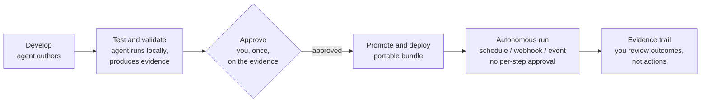

# aart — Product

aart is OSS infrastructure that lets your AI coding agent build automation it can prove works, that you approve once, and that then runs itself in production — all from inside the agent and CLI you already use, with no new platform to adopt.

## The two actors

- **The agent** (Claude Code / Codex / Cursor) — the **author and operator**. It builds the blocks and workflows, runs them locally to prove they work, and — once you approve — operates them.
- **You** — the **approver and owner**. You don't write the automation and you don't babysit it. You review the evidence and approve the artifact.

## The bet

The agent is the **author** of durable automation — not a human clicking through a workflow GUI, and not an LLM improvising each run. What it produces is a real, portable, governed **artifact** that you own, that accumulates, and that gets reused.

## The lifecycle

This is the product. Every boundary is a gate; evidence accumulates throughout.

1. **Develop** — you ask your agent for an automation; it authors a block or workflow in your normal flow. No new editor.
2. **Test & validate (locally)** — the agent runs it locally and *proves it works* — captured as evidence: what ran, outputs, screenshots, errors. It iterates until clean. Show me, don't tell me.
3. **Approve** — you review the evidence and approve the artifact, **once**. You're signing off on something already shown to work, not a promise.
4. **Promote & deploy** — you promote the approved artifact to an environment (staging, production). aart packages it into a **portable bundle** — which can be wrapped in a container for delivery.
5. **Run autonomously** — it runs itself on triggers (schedule, webhook, event) in the target environment. No human in the loop per run, no approval per step. Evidence keeps accumulating; you review the evidence, not the actions.

## How you touch it

Through your **coding agent (MCP)** and a **CLI** — the tools you already use. A **local dashboard** shows the evidence. aart **rides existing ecosystems** (npm, containers, OpenTelemetry, your secret manager). There is no new console and nothing to log into.

## What makes it different

- **Agent-authored**, not human-GUI-built.
- **Proven-by-evidence and governed**, not raw or ungoverned access.
- **A portable artifact you own**, not platform lock-in.
- **Approve the artifact, review the evidence** — not approve-every-step.
- **OSS infrastructure**, not a paid product.

## What it is not

- Not a chatbot or an LLM — your agent is the brain.
- Not a drag-and-drop workflow GUI.
- Not a hosted SaaS.
- Not a tool that nags you to approve every action.

## In practice

You tell your agent: *"build a nightly check that our three services are healthy and alert me if not."* It authors the workflow, runs it locally, and shows you a green evidence report. You approve it and promote it to production. From then on it runs every night on its own, pings Slack on failure, and leaves a full evidence trail for every run — and you never wrote a line of it or approved a single step.
